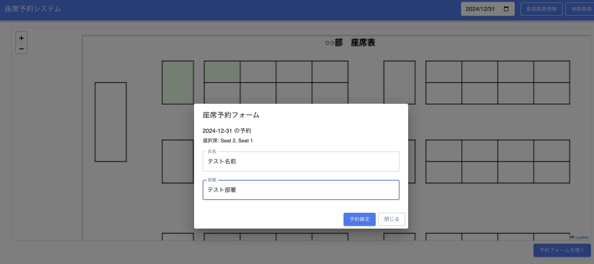
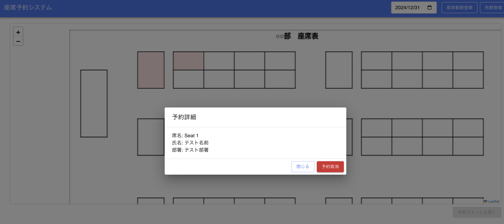
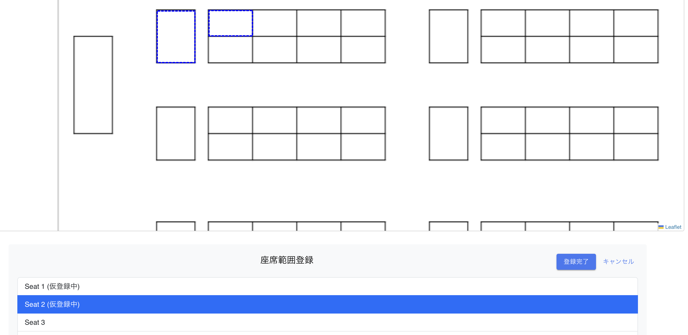
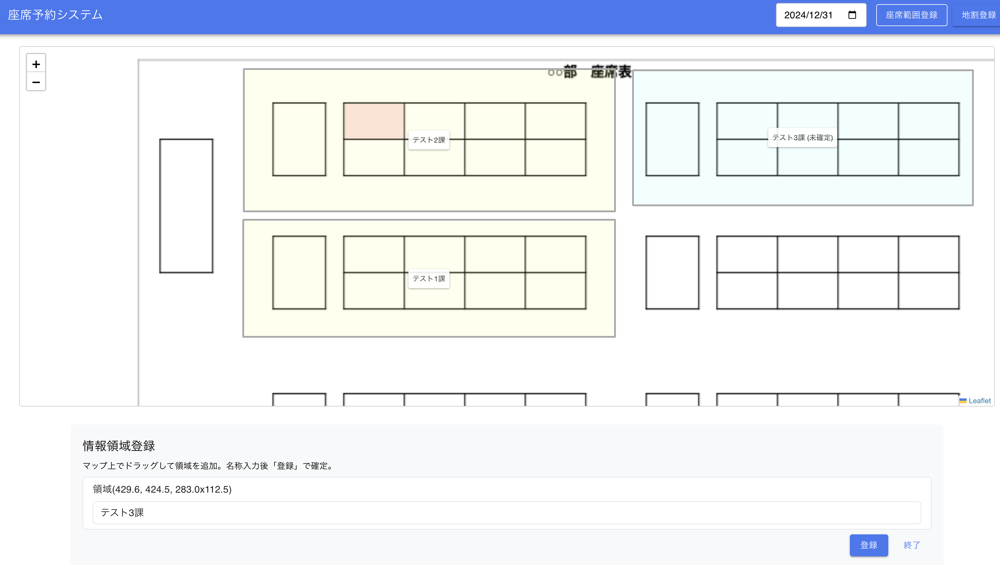
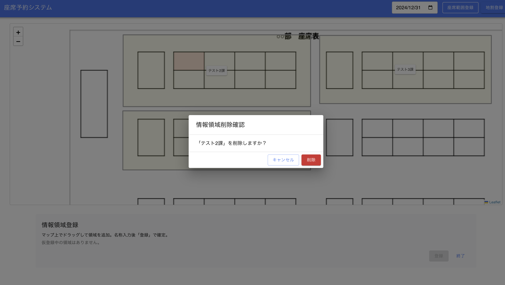

# 主要機能

## 座席予約
* 座席表から座席を登録できる機能です
* 座席表の座席を選択し、予約フォームを開くことで予約できます
* 一度に複数の座席を選択し、予約することも可能です

## 座席予約取消
* 座席予約を取り消すことができる機能です
* 座席表から予約済みの座席をクリックすることで予約を取り消すことができます

## 座席範囲登録
* DBに保存されている座席に対して、座席表から座席範囲を登録できる機能です
* 座席範囲登録ボタンを押下することで機能を利用できます
* 一度に複数の座席範囲を登録することも可能です

## 地割登録
* 座席表に、矩形領域を表示し、どの部署に割り当てられているのか（地割）示すことができる機能です
* 地割登録ボタンを押下することで機能を利用できます
* 一度に複数の地割を登録することも可能です

## 地割取消
* 登録されている地割範囲を削除することができる機能です
* 地割登録ボタンを押下し、登録されている地割を座席表から選択することで機能を利用できます

